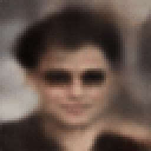

## Variational Autoencoder To Generate Faces

This project explores Variational Autoencoders (VAEs) with a focus on face image reconstruction and generation. The goal is to learn about the inner workings of VAEs, particularly how they map inputs to a compressed latent space and how the latent distribution can be used for image generation. I also wanted to get hands-on with the latent math, such as the reparameterization trick, KL divergence, and how they affect the model's ability to generate meaningful images.

## Purpose
The primary motivation behind this project was to dive deeper into VAEs and understand how they work under the hood. Specifically, I aimed to learn:

- How VAEs encode data into a latent space.
- How the probabilistic nature of the VAE helps in generating variations of data.
- The math behind the reparameterization trick and how it impacts training.
- How tweaking the encoder's bottleneck size and the decoder structure impacts output quality.

## Summary
The current model architecture takes face images as input, encodes them into a 512-dimensional latent vector, and decodes them back to reconstruct the original image. I've experimented with different encoder and decoder structures, learning from the reconstruction quality and how well the latent space captures face features.